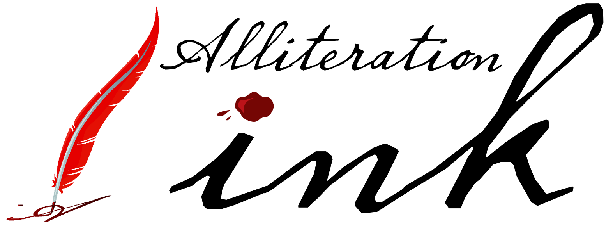

# Respect Policy

  \  

## Respect Policy Online

Alliteration Ink strives to create a professional atmosphere free of all forms of harassment, exploitation, or intimidation. Alliteration Ink will respond promptly and effectively to reports of harassment and discrimination of any kind and will take appropriate action to prevent, to correct, and if necessary, to discipline behavior that violates this policy. This policy applies to any events or spaces sponsored by Alliteration Ink, including the website, official twitter feed, mailing lists, or real-world events.

I, Steven Saus, want to know if any of the professionals I have worked with have engaged in sexist (or racist, or homophobic) behaviors. Especially when that behavior crosses the line into openly abusive language. Further, I want to know if any of the professionals I have worked with have engaged in sexual harassment. Bigotry and discrimination are not acceptable professional behavior.

My email is <a href="&#109;a&#105;&#108;&#116;&#111;&#58;&#115;&#116;&#101;&#118;e&#110;&#64;&#97;&#108;&#108;&#105;&#116;&#101;&#114;&#97;&#116;&#105;&#111;&#110;&#105;&#110;&#107;&#46;&#99;&#111;&#109;">&#115;&#116;&#101;&#118;&#101;n&#64;&#97;&#108;&#108;&#105;&#116;&#101;&#114;&#97;&#116;&#105;o&#110;in&#107;&#46;&#99;&#111;&#109;</a>; please direct all complaints (formal or informal) there.

## Respect Policy for Conventions

For me (Steven Saus) to be present as a panelist, vendor, participant, or GoH at a convention in my role as an individual or as Alliteration Ink, the following must be in place:

1. That the convention has a harassment policy, and that the harassment policy is clear on what is unacceptable behavior, as well as to whom those who feel harassed, or see others engaging in harassing behavior, can go for help and action.
2. That the convention make this policy obvious by at least one and preferably more than one of the following: posting the policy on their Website, placing it in their written and electronic programs, putting up flyers in the common areas, discussing the policy at opening ceremonies or at other well-attended common events.
3. In cases when I am invited as a Guest of Honor, personal affirmation from the convention chair that a harassment policy exists, that it will be adequately publicized to conventiongoers, and that all harassment complaints will be dealt with promptly and fairly, with no excuses or rationalizations for delaying action when such becomes necessary. 

## Attribution, Prior Versions, Licensing

* A copy of this policy was originally at [https://gist.github.com/uriel1998/5711406](https://gist.github.com/uriel1998/5711406); this document supercedes it.
* This document is released under the MIT license
* Comments, including suggested revisions and inclusions to this policy, are welcome